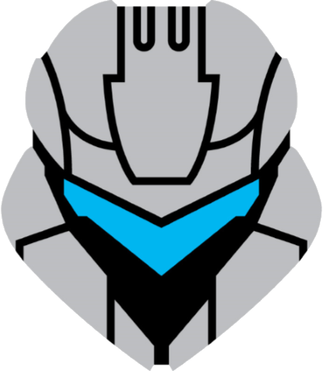
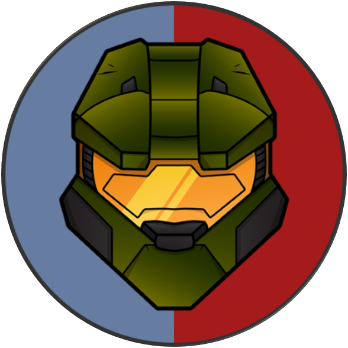
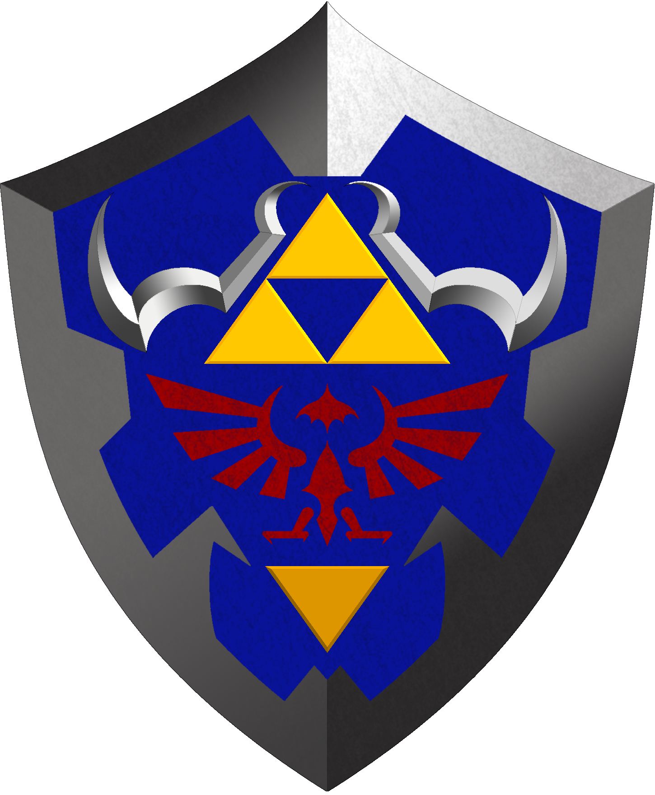

  

  <h1>Education</h1>
  

	

	<!-- Break -->
	

		

			<h3>
Leadership
</h3>
			

				

				

				

			

				
I work with a variety of groups and individuals to provide leadership, mentoring, and training. We all play a role and many of us wear multiple hats. We live in a changing world and to become leaders we must know how to follow. Employees are assets not liabilities which is why they need growth, reinforcement, and purpose. No mission is impossible with cooperative leaders and teams.

		

	

	

		

			<h3>
Security
</h3>
			

				

				

				

			

			
Protection of data and information matters to me. With rising threats over the years it is important to secure access from every corner. Physical, Network, and Application level security are susceptible to vulnerabilities. Security Tools and methodologies are critical in protecting company assests as well as users information. It is no longer a matter of "if you get hacked.." it is a matter of "when". Hackers are on the rise, are you ready?

		

	

	

		

			<h3>
Automation
</h3>
			

				

				

				

	
			

			
Tedious tasks are not fun. Imagine orchestrating the hard work within seconds and mitigating the decision making process. Whether the task at hand requires programming, machine learning, big data, or expertise in computing,  I provide automated solutions so you can run your business with less stress and more time. 

		

	

	
  

	<!-- Break -->
	

		

			<h3>University of South Florida</h3>
			

			

				
<b>Master of Science, Cybersecurity </b>  Concentration in Cyber Intelligence  Tampa, FL - 					Aug. 2018

		

	

		

		

			<h3>Polk State College</h3>
			

			

				
<b>Bachelor of Applied Science in Supervision and Management</b> Concentration in Business 					Administration  Winter Haven, FL - Dec. 2018

		

	

     <h3>University of South Florida</h3>
  
<b>Bachelor of Applied Science in Information Technology</b> Tampa, FL - Aug. 2013

  <h1> Certifications and Awards</h1>
  

  
<b>Comptia A+</b> Feb. 2008

  
<b>Certified Ethical Hacker</b> Nov. 2018

  
<b>5 Year Service Award</b> Polk State College

  
          
<h1>Skills</h1>

<ul>
    <li>Software & Hardware Implementation </li>
    <li>Scripting, Programming, & Cryptography </li>
    <li>Data Analysis, Information Security, Strategy & Decision Making</li>
    <li>System Access Control, Systems Administration, & Compliance
    <li>Security Risk Analysis, Cybersecurity Planning and Management</li>
    <li>Network Technology and Protocols, Network Defense, & Networking Concepts</li>
    <li>Problem Solving, Critical Thinking, & Decision Making</li>
    <li>Leadership, Communication, & Collaboration</li>

