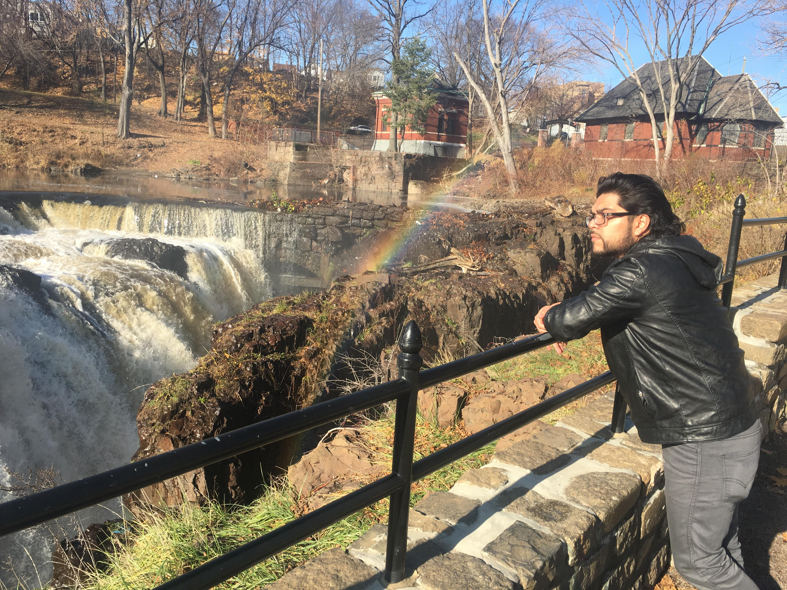

<!-- Main -->

<!-- One -->
<section id="one">
	

		<header class="major">
			<h2>Introduction</h2>
		</header>
		
Luis Fernandez Jr, born on August 10th, in New Jersey, is intrigued by user interfaces since his early childhood, and began to show interest in the science of computers around the early age of 6. Over the past years of technological advancements, Luis has become agile, proficient, and inspired by systems design within an organization as well as collaborative with a variety of functioning areas. As business evolves through the technological era, Luis continues to acquire knowledge in management of operations, and understanding the threats to provide thorough analysis and support for cybersecurity and IT operations.

	

</section>

<!-- Two -->
<section id="two" class="spotlights">
	<section>
		
		

			

				<header class="major">
					<h3>Accomplishments</h3>
				</header>
				
Recognition and Awards

				<ul class="actions">
					<li><a href="generic.html" class="button">Learn more</a></li>
				</ul>
			

		

	</section>
	<section>
		
		

			

				<header class="major">
					<h3>Interests & Hobbies</h3>
				</header>
				
I enjoy playing video games in my free time and I am very selective. I play a variety of Genres for fun but you can always find me playing the Super Smash Brothers franchise due to it's in depth mechanics and variety of options. Sun Tzu is more than accurate when saying “If you know the enemy and know yourself, you need not fear the result of a hundred battles." When it's comes to knowing options in your enviroment everything changes. Super Smash Brothers allows me to paint decision making process on screen. Controllers are my canvas and I enjoy depicting my style.

				<ul class="actions">
					<li><a href="generic.html" class="button">Learn more</a></li>
				</ul>
			

		

	</section>
	<section>
		
		

			

				<header class="major">
					<h3>p4</h3>
				</header>
				
TBD

				<ul class="actions">
					<li><a href="generic.html" class="button">Learn more</a></li>
				</ul>
			

		

	</section>
</section>

<!-- Three -->
<section id="three">
	

		<header class="major">
			<h2>Looking ahead</h2>
		</header>
		
Ethical Hacking Certification is my next goal. I am prepped with knowledge and working in virtual labs for hands-on experience. Building on the skills to find vulnerabilities or White Hat Hackers interests me. I admire those capable of finding exploits in software and hardware. I always enjoy new technology and I know that finding these security holes can benefit others. I currently hold a CompTIA A+ and practice towards the Security+ and CISSP certiffications.

Creating software for various platforms and providing creative solutions and teaching others of the interfaces and intricacies of a systems is my intent. By studying Cybersecurity, I educate others on threats and secure practices. I am also aware of the importance in confidentiality, authentication, and integrity. Maintaining user roles and permissions is important for auditing purposes and I continue to enjoy this line of work. Ultimately, my hobby in video games leads me to explore more and find areas of improvement. I'd  enjoy to protect and secure the services in entertainment that fail due to users participating in malicious activities. Maintaining services, development, and access control is important in todays world.  The potential of AI or extensive networking tools to maintain network security and Quality of Service is important going forward. Artificial Intelligence is a strong tool that can be used with or even against Cybersecurity. 

Expereince at SOFWERX involved real time threat analysis. With the experience as a Data Science Intern, utilizing Machine Learning to identify anomalous or adversarial actions based on packet data is one of many approaches a Cyber Analyst can take to identify threats. The internship brings me such a unique environment with lots to explore. 

		<ul class="actions">
			<li><a href="generic.html" class="button next">Get Started</a></li>
		</ul>
	

</section>

