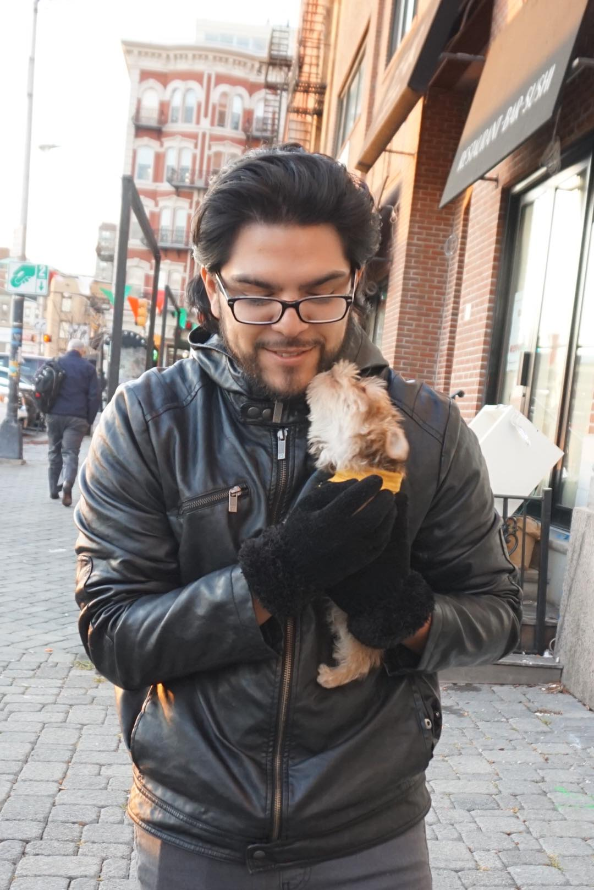

<!-- Main -->

<!-- One -->
<section id="one">
	

		<header class="major">
			<h2>Introduction</h2>
		</header>
		
Luis Fernandez Jr. is a Threat Intelligence Analyst in the Microsoft Defender Security Research organization. Luis holds a bachelors in Information Technology, Business Administration and a Master’s degree in Cybersecurity focused on Threat Intelligence from the University of South Florida, earned in 2013, 2017, and 2018, respectively. He was a lead SOC analyst for one of the largest Healthcare organizations in the United States and also served as a Security Investigator for Microsoft's M365 Cloud ecosystem, investigating Nation-State attributed attacks, ransomware and business e-mail compromise (BEC). Luis grew up interacting with user interfaces and computer systems, and he began to show interest in the science of computers since his early childhood. Over the years of technological advancements, Luis became agile, proficient, and inspired by systems and their design. Today, Luis continues to work to provide global security defense and support as a security professional.

	

</section>

<!-- Two -->
<section id="two" class="spotlights">
	<section>
		
		

			

				<header class="major">
					<h3>Accomplishments</h3>
				</header>
				
Luis has strongly supported and worked with a variety of industries. In 2008, the Heart of Florida Regional Medical Center offered Luis an opportunity to serve his community in providing IT support within the Health Care industry. After learning how Medical Information Systems operated, Luis began to provide sales, support, and management with MF Electronics, an electronics components retailer. 

				
In 2012, Luis continued his IT career as a PC Support Specialist in Polk State College. While working on a Bachelor’s Degree in Information Technology, Luis began to shadow Saddle Creek Logistics in order to study the company’s culture. With Luis’s wide array of experience he took the role as Data Analyst for Financial Aid within Polk State College. 
				

				
In 2015, Luis began his graduate studies in Cybersecurity. From supporting software and hardware, to  providing analysis and data mining, Luis became capable of seeing a wider scope of terrain. During the Data Analyst role, Luis worked with SOFWERX, a company partnered with United States Special Operations Command (USSOCOM) to provide innovative solutions.
				

				
After learning an extensive amount of technologies involving systems implementations, machine learning, security access control, data analysis, and information technology support, Luis narrowed his scope towards information security. Upon learning about cyber threats, defensive strategies, and security methods, Luis strengthens his skillset in the field of Cybersecurity. Today, Luis continues to learn about new methodologies in order to defend, support, and secure users and their organizations.
				

				<ul class="actions">
					<li><a href="generic.html" class="button">Learn more</a></li>
				</ul>
			

		

	</section>
	<section>
		
		

			

				<header class="major">
					<h3>Interests & Hobbies</h3>
				</header>
				
Luis enjoys playing a variety of puzzles and games in his free time. With a variety of genres to select from he always leans towards the Super Smash Brothers franchise, due to it's in depth mechanics and variety of options. Luis portrays Sun Tzu's quote, “If you know the enemy and know yourself, you need not fear the result of a hundred battles." Luis understands the principle of knowing your options in your environment. Super Smash Brothers allows Luis to paint his decision making process on screen. Controllers are considered to be a paintbrush for Luis, and the screen is his canvas as he enjoys depicting his style.

				<ul class="actions">
					<li><a href="generic.html" class="button">Learn more</a></li>
				</ul>
			

		

	</section>
	<section>
		
		

			

				<header class="major">
					<h3>Lifelong Learning</h3>
				</header>
				

Creating software, providing solutions, and teaching others of the intricacies of a system is my intent. By studying Cybersecurity, I educate others in fundamentals in computing and secure practices. I am aware of the importance in confidentiality, authentication, and integrity. Maintaining user roles and permissions is important for auditing purposes and I continue to enjoy this line of work. In my spare time when playing mind challenging games, I can explore more and find areas of improvement. I'd enjoy protecting and securing technical services on a global aspect in order to protect users from malicious activities or exploits. Maintaining services, development, and access control is important in today's world.  The potential of AI or extensive networking tools to maintain network security and Quality of Service is important going forward. Artificial Intelligence is a strong tool that can be used with or even against Cybersecurity. 

When experiencing technology solutions at SOFWERX, I became involved with real time threat analysis. With the experience as a Data Science Intern, utilizing Machine Learning to identify anomalous or adversarial actions based on packet data is one of many approaches a Cyber Analyst can take to identify threats. The internship brings me such a unique environment with lots to explore. 

				<ul class="actions">
					<li><a href="generic.html" class="button">Learn more</a></li>
				</ul>
			

		

	</section>
</section>

<!-- Three -->
<section id="three">
	

		<header class="major">
			<h2>Thank You For Reading</h2>
		</header>
		<ul class="actions">
			<li><a href="generic.html" class="button next">See My Credentials</a></li>
		</ul>
	

</section>

